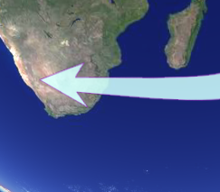
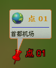
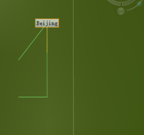

## 绘制
### 绘制线
EnumAction3D可调用绘制活动，DrawPolyline绘制线。
代码：  
```C#
 globeControl1.Globe.Action = EnumAction3D.DrawPolyline;
```
### 绘制面
DrawPolygon绘制面。

代码：
```C#
globeControl1.Globe.Action = EnumAction3D.DrawPolygon;
```

### 绘制水面
添加子图层绘制水面运用EnumAction3D中的DrawWater方法。

```C#
TreeNode featureAddLayerTreeNode = GetDestLayerFeatureAddTreeNode();
            if (featureAddLayerTreeNode == null)
            {
                MessageBox.Show("没有设置目标图层，请先设置!");
                return;
            }
            GSOLayer layer = featureAddLayerTreeNode.Tag as GSOLayer;
            if (!layer.Visible || !layer.Selectable || !layer.Editable)
            {
                MessageBox.Show("请确保目标图层可视、可选、可编辑!");
                return;
            }
            globeControl1.Globe.Action = EnumAction3D.DrawWater;
            ActionToolMenuChecked();
```
### 绘制点
绘制点就比较特殊一点，首先改变鼠标的动作为NormalHit：
```C#
globeControl1.Globe.Action = EnumAction3D.NormalHit;
```
然后需要添加鼠标放下和鼠标抬起的事件：
```C#
//鼠标按下事件，获取坐标
globeControl1.MouseDown += (sender, e) =>
{
    Location_MouseDown = e.Location;
};

//鼠标抬起事件
globeControl1.MouseUp += (sender, e) =>
{
    //鼠标抬起如果坐标不能对上，就认定为拖动球，不反应
    if (Location_MouseDown != e.Location)
        return;

    if (e.Button == MouseButtons.Left)
    {
        //如果按照上面示例按我们方法添加HUD，需要加上这个判断，判断是否点在HUD中
        //if (isMouseInHudControl == false)
        {
            if (globeControl1.Globe.Action == EnumAction3D.NormalHit)
            {
                GSOPoint3d point3d = new GSOPoint3d();

                GSOFeature newFeature = new GSOFeature();
                GSOGeoMarker p = new GSOGeoMarker();
                GSOMarkerStyle3D style = new GSOMarkerStyle3D();
                style.IconPath = Application.StartupPath + "/Resource/image/DefaultIcon.png";
                p.Style = style;
                p.Z = point3d.Z <= 0 ? 0 : point3d.Z;
            if (point3d.Z <= 0.0)
                {
                    point3d = globeControl1.Globe.ScreenToScene(e.X, e.Y);
                }
                p.X = point3d.X;
                p.Y = point3d.Y;
                p.Z = point3d.Z;
                newFeature.Geometry = p;
                newFeature.Name = "我的地标";

                globeControl1.Globe.MemoryLayer.AddFeature(newFeature);
                globeControl1.Globe.Action = EnumAction3D.ActionNull;
            }
        }
    }
};

```

### 绘制箭头
代码：  

```C#
 globeControl1.Globe.Action = EnumAction3D.DrawArrow;
 ```
 效果图：   

 

## 标注
### 气泡提示
（？）
LocaSpace提供GSOBalloon 功能，用户把鼠标放在场景中的几何对象(GSOFeature)上面稍作停留，该几何对象上就会出现GSOBalloon，显示该几何对象Name和Description属性。目前，GSOBalloon仅对点和模型起作用，对于线和多边形不起作用。GSOBalloon的效果如下图所示：   



ToolTip的显示与隐藏是通过场景和几何对象的一系列事件(Event)实现的，这些事件包括：

FeatureMouseOverEvent（该事件的触发需要设置控件的FeatureMouseOverEnable属性为true）
FeatureMouseHoverEvent
FeatureMouseIntoEvent
MouseMove
FeatureMouseOutEvent等。

以下代码使用FeatureMouseIntoEvent和FeatureMouseOutEvent实现ToolTip的方法：

```C#

            featureTooltip = new GSOBalloon(globeControl1.Handle);      //实例化GSOBalloon对象
            featureTooltip.SetSize(EnumSizeIndex.ROUNDED_CX, 5); // 设置边角的圆润度
            featureTooltip.SetSize(EnumSizeIndex.ROUNDED_CY, 5); // 设置边角的圆润度
            featureTooltip.SetSize(EnumSizeIndex.MARGIN_CX, 3);  // 设置空白边缘宽度
            featureTooltip.SetSize(EnumSizeIndex.MARGIN_CY, 3);  // 设置空白边缘宽度
            featureTooltip.SetSize(EnumSizeIndex.ANCHOR_HEIGHT, 30); // 设置GSOBalloon 锚的高度
            featureTooltip.EscapeSequencesEnabled = true;
            featureTooltip.HyperlinkEnabled = true;  // 设置是否可以点击GSOBalloon里面的超链接
            featureTooltip.Opaque = 30;  // 透明度，取值范围是0～100，0为不透明，100为全透明
            featureTooltip.MaxWidth = 300;  // 最大宽度
            featureTooltip.SetBorder(Color.FromArgb(255, 255, 128, 64), 1, 1);  // 边框
            featureTooltip.SetColorBkType(EnumBkColorType.SILVER);  //填充颜色
                                                                    // 也可以下面方法设置
                                                                    //featureTooltip.SetColorBk(Color.FromArgb(255, 255, 255, 255), Color.FromArgb(255,240, 247, 250), Color.FromArgb(255,192, 192, 200));
            featureTooltip.SetEffectBk(EnumBkEffect.VBUMP, 10); //渐变效果
            featureTooltip.SetShadow(0, 0, 50, true, 0, 0); // 阴影
                                                            //featureTooltip.CloseButtonVisible = true;  //显示关闭按钮
                                                            //鼠标进入显示气泡
            globeControl1.FeatureMouseIntoEvent += (sender1, e1) =>
            {
                if (!featureTooltip.IsVisible())
                {
                    String str1 = "<table><tr><td valign=vcenter><center><h2> " + e1.Feature.Name + "</h2><br><hr color=blue></center></td></tr></table>";
                    String str2 = e1.Feature.Description;

                    // 显示GSOBalloon
                    featureTooltip.ShowBalloon((int)e1.MousePos.X, (int)e1.MousePos.Y, str1 + str2);

                }
            };

            //鼠标移出时隐藏气泡
            globeControl1.FeatureMouseOutEvent += (sender1, e1) =>
            {
                if (featureTooltip.IsVisible())
                {
                    globeControl1.SwapBuffer(); //为了避免闪屏
                    featureTooltip.HideBalloon();
                }

            };

```
### 标注
LocaSpace提供要素标注功能，可以通过引线把属性的信息和要素进行关联：
以下代码展示的内容是，在指定坐标点放置一条线，用文字标注这条线。
```C#
 private void button8_Click(object sender, EventArgs e)
        {
            GSOGeoPolyline3D polyline = new GSOGeoPolyline3D();
            GSOPoint3ds polylinePnts = new GSOPoint3ds();
            polylinePnts.Add(new GSOPoint3d(116.7, 39.8, 0));
            polylinePnts.Add(new GSOPoint3d(116.8, 39.9, 0));
            polylinePnts.Add(new GSOPoint3d(116.8, 39.7, 0));
            polylinePnts.Add(new GSOPoint3d(116.7, 39.7, 0));

            polyline.AddPart(polylinePnts);

            GSOLabel label = new GSOLabel();
             label.Text = ("Beijing");
            GSOLabelStyle style = new GSOLabelStyle();
            style.TractionLineColor = Color.Blue;
            style.TracktionLineWidth = 50;

            GSOFeature feature = new GSOFeature();
            feature.Geometry = polyline;
            globeControl1.Globe.MemoryLayer.AddFeature(feature);
            feature.Label = label;
            globeControl1.Globe.FlyToFeature(feature);

        }
```

示意图：


还可以设置标注的透明度等内容：
设置透明度：
```C#
label.Style.Opaque = 0.8;
```

设置引线类型：
```C#
label.Style.TracktionLineType = EnumTracktionLineType.Dot;
```

设置字体大小
```C#
label.Style.TextStyle.FontHeight = 20;
```
设置字体类型
```C#
label.Style.TextStyle.FontName = "黑体"
```
设置标注位置
```C#
label.Style.TractionLineEndPos = new GSOPoint2d(0, 60);
```
设置是否为斜体
```C#
label.Style.TextStyle.Italic = true;
```
设置边框颜色
```C#
label.Style.OutlineColor = Color.Red;
```
设置标注的边框粗细
```C#
label.Style.OutlineWidth = 1;
```

设置标注的引线粗细
```C#
label.Style.TracktionLineWidth = 1;
```
设置标注矩形区的颜色渐变
```C#
label.Style.BackBeginColor = Color.Orange;
label.Style.BackEndColor = Color.PaleGreen;
```


