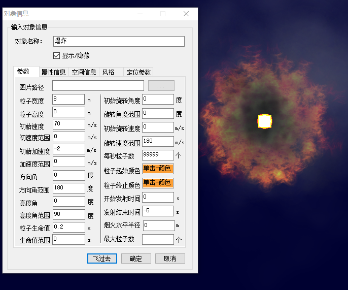

## 图层
### 添加图层
首先将窗体添加一个panel，并添加代码
``` panel1.Controls.Add(globeControl1); ```
(该代码处于原来添加球体代码：```  globeControl1.Dock = DockStyle.Fill; ```之上)  


添加一个按钮（button）添加按钮的事件代码：
 ```C#
      private void button1_Click(object sender, EventArgs e)
        {
            GSOLayer tdtLayer = globeControl1.Globe.Layers.Add("D:\\hzhang\\天地图标注.lrc");
            globeControl1.Globe.Layers.Add( "D:\\hzhang\\天地图标注.lrc");
            //刷新球
            globeControl1.Refresh();
        }
```

效果图  


### 删除图层
添加按钮（button）在按钮中添加事件
```C#
    private void button1_Click_1(object sender, EventArgs e)
        {
            //删除图层有三种方法
            //1.根据图层删除
            //根据说明查找图层，说明为文件名称（不带后缀）
            GSOLayer layer = globeControl1.Globe.Layers.GetLayerByCaption("天地图标注");
            globeControl1.Globe.Layers.Remove(layer);
            //2.根据图层目录删除
            globeControl1.Globe.Layers.Remove(
            Application.StartupPath + "\\Resource\\gisdata\\tianditudata\\天地图标注.lrc");
            //3.根据索引删除
            globeControl1.Globe.Layers.Remove(1);
            //还有几个删除方法
            //全部删除
            globeControl1.Globe.Layers.RemoveAll();
            //根据图层ID删除
            globeControl1.Globe.Layers.RemoveLayerByID(1);

        }
 ```
### 显示隐藏图层

创建一个按钮（button）在事件中添加显示隐藏图层：

```C#
private void btnShowD_Click(object sender, EventArgs e)
{
//根据说明查找图层，说明为文件名称（不带后缀）
GSOLayer layer = globeControl1.Globe.Layers.GetLayerByCaption("天地图地图");
layer.Visible = !layer.Visible;
}

```

### 图层顺序调整

我们在原来的基础之上需要重新添加一个图层。添加图层之后，添加一个新的按钮（button）在按钮之中添加事件：
```C#
 private void button2_Click(object sender, EventArgs e)
        {
            
            //图层的移动是通过索引移动的
            //索引越大表示越在商城，表示后绘制
            //将索引为1的图层移动到下一层，结果为该图层的索引变为2，原来索引为2的图层变为1
            globeControl1.Globe.Layers.MoveUp(1);
            //将索引为2的图层移动到上一层，结果为该图层索引变为1，原来索引为1的变为2
            globeControl1.Globe.Layers.MoveDown(2);
            //将索引为1的图层移动到索引为8的位置
            globeControl1.Globe.Layers.MoveTo(1, 2);

        }
```


## 元素

### 点
#### 添加点

创建点对象需要一下几个步骤：
1. 创建点的对象（GSOGeoMarker）。
2. 创建点的风格（GSOMarkerStyle3D()，把显示风格赋予点(point.Style=mystyle)。
3. 创建几何要素(GSOFeature)把点对象赋予几何要素。
4. 把几何要素添加到图层当中。
5. 将视角飞到创建点处。

代码：  
```C#
GSOGeoMarker point = new GSOGeoMarker();    //创建点对象
point.X = 120.417888231016;                          //设置点X的值，单位为度
point.Y = 31.3283140323302;                           //设置点Y的值，单位为度
point.Z = 100;                              //设置点Z的值，单位为米
point.AltitudeMode = EnumAltitudeMode.RelativeToGround;
//设置点的高程模式，设置为相对地面。则点的为（X,Y）处地面高程上方100米（point.Z = 100）
point.Text = "中科图新";                    //设置点对象显示的文字
GSOMarkerStyle3D mstyle = new GSOMarkerStyle3D();//新建点样式
mstyle.IconPath = Application.StartupPath + "\\Resource\\image\\DefaultIcon.png";     //设置图标路径
point.Style = mstyle;                       //把显示风格
GSOFeature feature = new GSOFeature();      //创建几何要素
feature.Geometry = point;                   //把点赋予集合要素
feature.Name = point.Text;                  //赋予名字
globeControl1.Globe.MemoryLayer.AddFeature(feature);//将要素添加到图层中

globeControl1.Globe.FlyToFeature(feature);//将视角飞到创建的点处  
globeControl1.Refresh();//刷新球
```
效果图：  

#### 点的风格
```C#
GSOMarkerStyle3D mstyle = new GSOMarkerStyle3D();//新建点样式
mstyle.IconPath = 
Application.StartupPath + "\\Resource\\image\\DefaultIcon.png";//设置图标路径
mstyle.IconVisible = true;              //标注图标是否可见
mstyle.TextAvoidance = false;           //标注文本是否为空
mstyle.TextStyle = new GSOTextStyle();  //标注文本风格（详情请见“文本风格”）
mstyle.TextVisible = true;              //标注文本是否可见
```
### 线
#### 添加线
1. 创建线对象需要将点对象添加到线中：
2. 创建线的对象（GSOGeoPolyline3D）
3. 创建节点对象（GSOPoint3ds）把节点添加到线中（注意，一条线至少需要两个点构成）
4. 创建线的风格（GSOSimpleLineStyle3D)，将风格添加到线上。
5. 创建几何要素，将线添加到几何要素当中。
6. 把几何要素添加到图层当中。
7. 将视角飞到创建的线上。
8. 刷新球。
代码：
```C#  
GSOGeoPolyline3D line = new GSOGeoPolyline3D(); //创建线对象
GSOPoint3ds pnts = new GSOPoint3ds(); //创建节点对象
pnts.Add(new GSOPoint3d(116.6, 39.9, 1000));    //把各节点添加到节点对象上
pnts.Add(new GSOPoint3d(116.61, 39.91, 3000));
pnts.Add(new GSOPoint3d(116.62, 39.92, 2000));
pnts.Add(new GSOPoint3d(116.63, 39.90, 2500));
pnts.Add(new GSOPoint3d(116.64, 39.94, 4000));
line.AddPart(pnts); //把节点添加到线上
GSOSimpleLineStyle3D style = new GSOSimpleLineStyle3D(); //创建线的风格
//设置透明度及颜色，FromArgb()中的四个参数分别为alpha、red、green、blue，取值范围为0到255
style.LineColor = Color.FromArgb(150, 0, 255, 0);
style.LineWidth = 3;          //设置线的宽度为3
style.VertexVisible = true; 	//显示线的节点
line.Style = style;          //把风格添加到线上
//创建几何对象并设置属性
GSOFeature f = new GSOFeature();
f.Geometry = line;           //把线对象添加到几何对象上
f.Name = "线 01";          //设置几何对象的名称
f.SetFieldValue("description", "这是线的属性");       //设置几何对象的字段值
//把几何要素添加到内存图层中
globeControl1.Globe.MemoryLayer.AddFeature(f);
globeControl1.Globe.FlyToFeature(feature);//将视角飞到创建的线处  
//刷新球
globeControl1.Refresh();
```


效果图：   


#### 线的风格
线的风格包含颜色，宽度，样式等内容。
```C#
GSOSimpleLineStyle3D style = new GSOSimpleLineStyle3D(); //创建线的风格
//设置透明度及颜色，FromArgb()中的四个参数分别为alpha、red、green、blue，取值范围为0到255
style.LineColor = Color.FromArgb(150, 0, 255, 0);
style.LineWidth = 3;          //设置线的宽度为3
style.VertexVisible = true; 	//显示线的节点
style.LineType = EnumLineType.Custom;//设置线的类型
```

### 面
#### 添加面
添加面也需要添加节点，由节点构成面。
代码：
```C#
  private void button5_Click(object sender, EventArgs e)
        {
            GSOGeoPolygon3D geoPolygon = new GSOGeoPolygon3D(); //创建多边形对象

            //创建节点对象
            GSOPoint3ds polygonPnts = new GSOPoint3ds();
            polygonPnts.Add(new GSOPoint3d(116.7, 39.8, 0));
            polygonPnts.Add(new GSOPoint3d(116.8, 39.9, 0));
            polygonPnts.Add(new GSOPoint3d(116.8, 39.7, 0));
            polygonPnts.Add(new GSOPoint3d(116.7, 39.7, 0));

            geoPolygon.AddPart(polygonPnts);    //把节点添加到多边形对象上

            GSOSimplePolygonStyle3D stylePolygon = new GSOSimplePolygonStyle3D();    //创建风格
            stylePolygon.OutLineVisible = true;    //显示多边形的边缘线
                                                   //设置多边形的填充颜色，FromArgb()中的四个参数分别为alpha、red、green、blue，取值范围为0到255
            stylePolygon.FillColor = Color.FromArgb(100, 255, 255, 0);
            geoPolygon.Style = stylePolygon;  //把风格添加到多边形上

            //创建几何对象并设置属性
            GSOFeature f = new GSOFeature();
            f.Geometry = geoPolygon;
            f.Name = "多边形 01";
            f.SetFieldValue("description", "a demo polygon");

            globeControl1.Globe.MemoryLayer.AddFeature(f);  //把几何要素添加到内存图层中
            globeControl1.Globe.FlyToFeature(f);                                              
            globeControl1.Refresh();//刷新球

        }
```

效果图：  


#### 面的风格

```C#
 GSOSimplePolygonStyle3D stylePolygon = new GSOSimplePolygonStyle3D();    //创建风格
            stylePolygon.OutLineVisible = true;    //显示多边形的边缘线
                                                   //设置多边形的填充颜色，FromArgb()中的四个参数分别为alpha、red、green、blue，取值范围为0到255
            stylePolygon.FillColor = Color.FromArgb(100, 255, 255, 0);
            stylePolygon.Fill = true;                           //面内部是否填充
            stylePolygon.OutLineVisible = true;                 //是否显示轮廓线
            stylePolygon.OutlineStyle = new GSOLineStyle3D();   //轮廓线样式（参考线风格）
            stylePolygon.TextureParam = new GSOTextureParam();  //表面纹理样式
            stylePolygon.UsingBlur = true;                      //是否有发光风格
            stylePolygon.UsingBothFace = true;                 //是否启用双面渲染
            stylePolygon.UsingDepthTest = true;                 //风格是否支持深度探测
            stylePolygon.UsingLight = true;                     //是否使用光照
            stylePolygon.UsingSecondaryColor = true;              //是否使用SecondaryColor颜色
            stylePolygon.UsingSingleColor = true;                 //是否使用单一颜色
            stylePolygon.UsingTexture = true;                    //是否支持贴图效果
            stylePolygon.TextureParam = new GSOTextureParam();   //获取或设置表面纹理
```
### 模型
#### 添加模型
添加模型需要先创建模型对象（GSOGeoModel），创建点坐标，将模型放置在点的位置上。模型可以设置模型风格。
```C#
      private void button6_Click(object sender, EventArgs e)
        {
            GSOGeoModel model = new GSOGeoModel(); //创建模型   
            GSOPoint3d pt = new GSOPoint3d(); //创建点
            pt.X = 116.6;
            pt.Y = 39.9;
            pt.Z = 0;

            GSOModelPointStyle3D style = new GSOModelPointStyle3D();  //创建模型的风格       
            model.Style = style;

            //模型可以是3ds、obj、gse、gsez格式的三维模型
            //模型所在路径，用户可根据实际情况进行设置
            string filepath = "E:\\Data\\人工模型\\坦克.3ds";

            //设置模型
            model.FilePath = filepath;
            model.Position = pt;

            model.AltitudeMode = EnumAltitudeMode.ClampToGround; //把几何体放到地面上

            GSOFeature f = new GSOFeature(); //创建几何要素
            f.Geometry = model;
            f.Name = "模型 01";
            f.Description = "模型 01";  //设置feature description的值，这个值将在tooltip上显示

            //把几何要素添加到内存图层中 
            GSOFeature newFeature = globeControl1.Globe.MemoryLayer.AddFeature(f);
            globeControl1.Refresh();    //刷新场景
            globeControl1.Globe.FlyToFeature(f);  //飞行到模型所在的位置
                                                  //刷新球
            globeControl1.Refresh();

        }
```
### 批量添加模型
通过窗口得到原数据路径以及放置方式。使一部分模型批量放置在球上。
代码：
```C#
AddMultiModeDlg dlg = new AddMultiModeDlg();
            if (dlg.ShowDialog() == DialogResult.OK)
            {
                TreeNode featureAddLayerTreeNode = GetDestLayerFeatureAddTreeNode();
                if (featureAddLayerTreeNode != null)
                {
                    GSOLayer featureAddLayer = (GSOLayer)featureAddLayerTreeNode.Tag;
                    int nSelFileNum = dlg.m_arryFileSel.Count;
                    for (int i = 0; i < nSelFileNum; i++)
                    {
                        string strFilePath = dlg.m_arryFileSel[i].ToString();
                        string strFileExt = Path.GetExtension(strFilePath).ToLower();
                        string strFileName = Path.GetFileName(strFilePath);
                        int nIndex = strFileName.LastIndexOf('.');
                        string strTitle = strFileName.Substring(0, nIndex);

                        GSOFeature f = new GSOFeature();


                        if (strFileExt == ".gcm") // 如果是gcm需要提前加载坐标信息
                        {
                            GSOGeoModel model = new GSOGeoModel();
                            model.FilePath = strFilePath;
                            model.LoadGCMCoordInfo();
                            if (!model.IsCoordInfoValid())
                            {

                                GSOPoint3d pt = new GSOPoint3d();
                                pt.X = globeControl1.Globe.CameraState.Longitude;
                                pt.Y = globeControl1.Globe.CameraState.Latitude;
                                pt.Z = model.Position.Z;  // 注意z值还是要保留下来的
                                model.Position = pt;
                            }
                           
                            model.AltitudeMode = (EnumAltitudeMode)dlg.m_nAltitudeMode;
                            f.Geometry = model;
                        }
                        else if (strFileExt == ".gcmb") // 如果是gcm需要提前加载坐标信息
                        {
                            GSOGeoModelBag model = new GSOGeoModelBag();
                            model.FilePath = strFilePath;
                            model.LoadGCMCoordInfo();
                            if (!model.IsCoordInfoValid())
                            {

                                GSOPoint3d pt = new GSOPoint3d();
                                pt.X = globeControl1.Globe.CameraState.Longitude;
                                pt.Y = globeControl1.Globe.CameraState.Latitude;
                                pt.Z = model.Position.Z;  // 注意z值还是要保留下来的
                                model.Position = pt;
                            }
                            model.AltitudeMode = (EnumAltitudeMode)dlg.m_nAltitudeMode;
                            f.Geometry = model;
                        }
                        else if (strFileExt == ".cfa")
                        {
                            GSOGeoFrameAnimation model = new GSOGeoFrameAnimation();
                            model.FilePath = strFilePath;
                            model.LoadCFACoordInfo();
                            if (!model.IsCoordInfoValid())
                            {

                                GSOPoint3d pt = new GSOPoint3d();
                                pt.X = globeControl1.Globe.CameraState.Longitude;
                                pt.Y = globeControl1.Globe.CameraState.Latitude;
                                pt.Z = model.Position.Z;  // 注意z值还是要保留下来的
                                model.Position = pt;
                            }
                            model.AltitudeMode = (EnumAltitudeMode)dlg.m_nAltitudeMode;
                            f.Geometry = model;

                        }
                        else
                        {
                            GSOGeoModel model = new GSOGeoModel();
                            model.FilePath = strFilePath;
                            GSOPoint3d pt = new GSOPoint3d();
                            pt.X = globeControl1.Globe.CameraState.Longitude;
                            pt.Y = globeControl1.Globe.CameraState.Latitude;
                            pt.Z = 0;
                            model.Position = pt;
                            model.AltitudeMode = (EnumAltitudeMode)dlg.m_nAltitudeMode;
                            f.Geometry = model;
                        }


                        f.Name = strTitle;
                        featureAddLayer.AddFeature(f);


                    }
                    RefreshTreeNodeLayerFeatureList(featureAddLayerTreeNode);
                    globeControl1.Globe.Refresh();
```
效果图：  

### 添加动态对象
#### 添加喷泉
```C#

    //创建一个新要素
     GSOFeature newFeature = new GSOFeature();
     //创建一个喷泉对象  
            GSOGeoFountain geoFountain = new GSOGeoFountain();
    //创建相机视角
            GSOCameraState cameraState = globeControl1.Globe.CameraState;
    //设置喷泉位置
            geoFountain.SetPosition(cameraState.Longitude, cameraState.Latitude, 0);
    //设置喷泉时间间隔
            geoFountain.TimerInterval = 20;
    //将动作加在喷泉上
            geoFountain.Play();
    //将喷泉添加到Geometry当中
            newFeature.Geometry = geoFountain;
            newFeature.Name = "喷泉";
    //展示新建的要素
            ShowAddFeatureDlg(newFeature);
```
效果图：  


#### 添加帧动画模型
添加帧动画需要一个md2纹理路径和一个md2或cfa格式的模型路径文件，设置面板包括运动的对象名称，参数，属性信息，空间信息，风格，滚动，定位参数信息，全部设置完成后可根据设置的内容在球体上观察帧动画模型。  

代码：
```C# 
//创建一个新的要素
            GSOFeature newFeature = new GSOFeature();
//创建帧动画对象
           GSOGeoFrameAnimation geoFrameAnimation = new GSOGeoFrameAnimation();
//创建相机视角
            GSOCameraState cameraState = globeControl1.Globe.CameraState;

//为帧动画确定位置
            geoFrameAnimation.SetPosition(cameraState.Longitude, cameraState.Latitude, 0);
//设置帧动画
            geoFrameAnimation.Play();
//要素图层为帧动画图层
            newFeature.Geometry = geoFrameAnimation;
            newFeature.Name = "帧动画模型";
//展示该帧动画
            ShowAddFeatureDlg(newFeature);
```

#### 添加沿线运动对象
首先需要运用选中模式选中一条件，之后需要在设置窗口设置浏览模型文件设置模型路径，之后根据该模型设置运动的速度，路径等，并进行标注，创建新要素，把添加的沿线运动对象添加到要素当中，刷新球。  

代码：
```C#
      private void DynamicRouteMenuItem_Click(object sender, EventArgs e)
        {

            if (globeControl1.Globe.SelectedObject == null)
            {
                MessageBox.Show("请先选择一条线!");
                return;
            }

            GSOFeature lineFeature = globeControl1.Globe.SelectedObject;
            if (lineFeature.Geometry == null || lineFeature.Geometry.Type != EnumGeometryType.GeoPolyline3D)
            {
                MessageBox.Show("请先选择一条线!");
                return;

            }
            FrmDynamicRouteObj dlg = new FrmDynamicRouteObj();
            if (dlg.ShowDialog() == DialogResult.OK)
            {
                if (dlg.m_strModelPath == "")
                {
                    MessageBox.Show("没有选择模型路径!");
                    return;
                }
                GSOGeometry actorGeometry = null;
                string strFileExt = Path.GetExtension(dlg.m_strModelPath);
                if (strFileExt.ToLower() == ".md2")
                {

                    GSOGeoFrameAnimation curAnimation = new GSOGeoFrameAnimation();
                    curAnimation.MD2TexturePath = dlg.m_strMD2TexPath;
                    curAnimation.FilePath = dlg.m_strModelPath;
                    curAnimation.StartAnimationFrag = dlg.m_nStartAnimation;
                    curAnimation.EndAnimationFrag = dlg.m_nEndAnimation;
                    curAnimation.PlaySpeed = dlg.m_fPlaySpeed;
                    curAnimation.IsSlerpPlayed = dlg.m_bSlerp;
                    curAnimation.SetScale(dlg.m_fScale, dlg.m_fScale, dlg.m_fScale);
                    curAnimation.SetRotation(0, 0, dlg.m_fRotationg);
                    curAnimation.Play();
                    actorGeometry = curAnimation;               }
                else
                {
                    GSOGeoModel model = new GSOGeoModel();
                    model.FilePath = dlg.m_strModelPath;
                    model.SetScale(dlg.m_fScale, dlg.m_fScale, dlg.m_fScale);
                    model.SetRotation(0, 0, dlg.m_fRotationg);
                    actorGeometry = model;
               }
                GSOGeoDynamicRoute dynamicRoute = new GSOGeoDynamicRoute();
                dynamicRoute.ActorGeometry = actorGeometry;
                GSORoute route = new GSORoute();
                GSOGeoPolyline3D geoline = (GSOGeoPolyline3D)lineFeature.Geometry;
                for (int i = 0; i < geoline[0].Count; i++)
                {
                    route.Add(geoline[0][i]);

                }
                route.CircleRoute = dlg.m_bCircleRoute;
                route.Speed = dlg.m_fWalkSpeed;
                route.RotateSpeed = dlg.m_fRoteSpeed;
                route.AltitudeMode = geoline.AltitudeMode;
                dynamicRoute.Route = route;
                GSOFeature feature = new GSOFeature();
                dynamicRoute.Play();
                dynamicRoute.TimerInterval = 20;
                dynamicRoute.RepeatCount = dlg.m_nRepeatCount;
                feature.Geometry = dynamicRoute;
                GSOLabel gsoLabel = new GSOLabel();
                gsoLabel.Text = "Actor";
                feature.Label = gsoLabel;
                globeControl1.Globe.MinModelVisibleSize = 0;
                if (globeControl1.Globe.DestLayerFeatureAdd != null)
                {
                    globeControl1.Globe.DestLayerFeatureAdd.AddFeature(feature);
                }
                else
                {
                    globeControl1.Globe.MemoryLayer.AddFeature(feature);
                }
                globeControl1.Globe.Refresh();
            }
        }
```

#### 添加烟火
添加烟火对象可以设置对象名称，改变参数，属性信息，空间信息，风格，定位参数。
代码：
```C#
 private void YanhuoToolStripMenuItem_Click(object sender, EventArgs e)
        {
            GSOFeature newFeature = new GSOFeature();
         //将烟火对象添加到新要素当中
            newFeature = AddFireSmoke();
            newFeature.Name = "烟火";
        //输出设置烟火对象的窗口
            ShowAddFeatureDlg(newFeature);
        }
```

#### 添加爆炸
该功能包含的接口有GSOGeoParticle设置新的爆炸对象，由此可以设置爆炸的位置等，设置环形粒子发射器，由此可以设置该环形粒子发射器的模型样式，大小，角度，重力加速度，粒子生命周期（LifeFix）粒子生命浮动范围（LifeRnd，EmitPerSec，MaxCount）等内容。设置粒子初始颜色科通过Color接口实现线形插值的生成。最后为粒子，环形粒子添加效果器。将粒子赋予新的要素，返回该要素。  

代码：
```C#
 private GSOFeature AddExplosion()
        {
            string strResPath = Path.GetDirectoryName(Application.ExecutablePath) + "/Resource";
            GSOGeoParticle geoParticle = new GSOGeoParticle();
            geoParticle.SetPosition(globeControl1.Globe.CameraState.Longitude, globeControl1.Globe.CameraState.Latitude, 30);
            geoParticle.AltitudeMode = EnumAltitudeMode.RelativeToGround;
            GSORingParticleEmitter emitter = new GSORingParticleEmitter();
            emitter.TexturePath = strResPath + "/ParticleImage/flare3.png";
            emitter.SetSizeFix(8, 8);
            emitter.VelFix = 70;
            emitter.AccFix = -2.0f;
            emitter.GravityAcc = 9.8f; // 重力加速度
            emitter.AngleXYFix = 0;
            emitter.AngleXYRnd = 180;
            emitter.AngleXZFix = 0;
            emitter.AngleXZRnd = 90;
            //粒子生命
            emitter.LifeFix = 0.2f;
            //粒子生命浮动范围
            emitter.LifeRnd = 0.0f;
            emitter.EmitPerSec = 99999;
            emitter.MaxCount = 300;
            // 采用线性插值生成粒子的初始颜色
            emitter.ColorRndStart = Color.FromArgb(252, 158, 52);
            emitter.ColorRndEnd = Color.FromArgb(252, 158, 52);
            emitter.IsLumAdded = true; // 例子颜色亮度叠加+
            GSOIncreaseSizeParticleEffector effector1 = new GSOIncreaseSizeParticleEffector();
            effector1.SetIncreasePerSecond(-2, -2);
            effector1.StartTime = 0;
            effector1.EndTime = -5; // 负数表示整个粒子生命结束
            GSOColorParticleEffector effector2 = new GSOColorParticleEffector();
            effector2.SetColorChanged(0, 0, 0, -3);
            effector2.StartTime = 0.8f;
            effector2.EndTime = 1.5f;
            // 添加效果器
            emitter.AddEffector(effector1);
            emitter.AddEffector(effector2);
            geoParticle.AddEmitter(emitter);
            geoParticle.Play();
            GSOFeature feature = new GSOFeature();
            feature.Geometry = geoParticle;
            return feature;
        }
```
效果图：    


#### 添加水柱
在新要素上使用方法AddWaterLine（）可添加水柱。  

代码：  
```C#
GSOFeature newFeature = new GSOFeature();
            newFeature = AddWaterLine();
            newFeature.Name = "水柱";
            ShowAddFeatureDlg(newFeature);

```
效果图：  


### 添加规则几何对象
首先需要为添加的几个对象设置要素和位置，通过设置窗口（ShowAddFeatureDlg）来设置该要素的属性。  

代码：
```C#
        private void AddNewEntity(GSOGeoEntity geoEntity, string strName)
        {
            GSOFeature newFeature = new GSOFeature();
            GSOPoint3d pt = new GSOPoint3d();
            pt.X = globeControl1.Globe.CameraState.Longitude;
            pt.Y = globeControl1.Globe.CameraState.Latitude;
            pt.Z = 0;
            geoEntity.Position = pt;
            newFeature.Geometry = geoEntity;
            newFeature.Name = strName;
            ShowAddFeatureDlg(newFeature); }
```
#### 添加长方体
```C#
AddNewEntity(new GSOGeoBoxEntity(), "长方体");
```

效果图：   


#### 添加球
```C#
  AddNewEntity(new GSOGeoSphereEntity(), "球");
```
#### 添加柱
```C#
AddNewEntity(new GSOGeoCylinderEntity(), "柱");
```
#### 添加台
```C#
 AddNewEntity(new GSOGeoFrustumEntity(), "台")
```
#### 添加管台
```C#
AddNewEntity(new GSOGeoFrustumEntity(), "管台");
```
#### 添加椭球
```C#
 AddNewEntity(new GSOGeoEllipsoidEntity(), "椭球");
```
#### 添加椭球柱
```C#
 AddNewEntity(new GSOGeoEllipCylinderEntity(), "椭圆柱");
```
#### 添加椭球台
```C#
AddNewEntity(new GSOGeoEllipFrustumEntity(), "椭圆台");
```
#### 添加缺口椭球
```C#
AddNewEntity(new GSOGeoRangeEllipsoidEntity(), "缺口椭球");
```
#### 添加缺口椭球柱
```C#
AddNewEntity(new GSOGeoRangeEllipCylinderEntity(), "缺口椭圆柱");
```
#### 添加缺口椭球台
```C#
AddNewEntity(new GSOGeoRangeEllipFrustumEntity(), "缺口椭圆台");
```
### 要素操作
#### 要素获取
Feature 代表三维球上的元素，包括点线面和模型等，在一般的操作当中，需要创建要素，将点线面等添加到要素当中，再把要素添加到图层当中。
##### 全局变量获取
初始化获取代表着，当加入球体的时候，就用全局变量获取到这个要素。
```C#
GSOFeature feature; //创建一个全局变量
feature = globeControl1.Globe.MemoryLayer.AddFeature(f);  //添加的时候获取要素
MessageBox.Show("获取到：" + feature.Name);
```

##### 根据属性获取
可以根据要素的属性找到想要获取的要素
```C#
GSOFeature myFeature = null;
//根据CustomID获取①
myFeature = globeControl1.Globe.MemoryLayer.GetFeatureByCustomID(1);
//根据ID来获取要素
myFeature = globeControl1.Globe.MemoryLayer.GetFeatureByID(1);
//根据名称获取要素
myFeature = globeControl1.Globe.MemoryLayer.GetFeatureByName("多边形 01", true)[0];
//根据描述获取要素
myFeature = globeControl1.Globe.MemoryLayer.GetFeatureByDescription("这是一个多边形", true)[0];
//根据字段值来获取要素
feature = globeControl1.Globe.MemoryLayer.GetFeatureByFieldValue("坦克.3DS","2",true)[0];
```
##### 根据点击要素获取
根据点击三维球来获取点击到的要素。
```C#
//添加球点击事件
globeControl1.FeatureMouseClickEvent += (o, args) =>
{//判断是否为模型
    if (args.Feature != null)
    {
        MessageBox.Show("获取到:" + args.Feature.Name);
    }
```

##### 根据选中的要素获取
通过启用三维球的选种模式来获取已经选中的要素。
```C#
//改变球为选中模式
globeControl1.Globe.Action = EnumAction3D.SelectObject;
GSOFeature myFeature = null;
myFeature = globeControl1.Globe.SelectedObject;
MessageBox.Show("获取到:" + (myFeature == null?"null":myFeature.Name));
```

#### 要素删除
要素的删除首先要求查找到需要删除的要素。

1.通过Name，ID,Description等进行查找
通过Name：``` GSOFeature feature = globeControl1.Globe.MemoryLayer.GetFeatureByName("中科图新", false)[0];```  

通过ID：```Feature = globeControl1.Globe.MemoryLayer.GetFeatureByID(1);```   

通过Description ```Feature = globeControl1.Globe.MemoryLayer.GetFeatureByDescription("这是一个多边形", true)[0];```   


```C#
//删除命令 
feature.Delete();
//球刷新
globeControl1.Refresh();
```
2.通过全局变量中保存的GSOFeature要素进行删除：
```C#
lineFeature.Delete();
globeControl1.Refresh();
```
3.将要素的数据源绑定在树形图节点或者其他控件上，通过控件读取要素进行删除：
```C#
(btnRemovePolygon.Tag as GSOFeature).Delete();
globeControl1.Refresh();
```
4.通过在地图上选定要素进行删除：
```C#
//通过选中进行删除
if (globeControl1.Globe.SelectedObject == null)
{
    MessageBox.Show("已经切换为选择模式，请选择删除的要素，再点击此按钮！");
    globeControl1.Globe.Action = EnumAction3D.SelectObject;
    return;
}

globeControl1.Globe.Action = EnumAction3D.ActionNull;
globeControl1.Globe.SelectedObject.Delete();
globeControl1.Refresh();
```


#### 要素的显示与隐藏
获取要素之后，可以对要素进行二次更改
```C#
feature.Visible = !feature.Visible;
globeControl1.Refresh();
```


